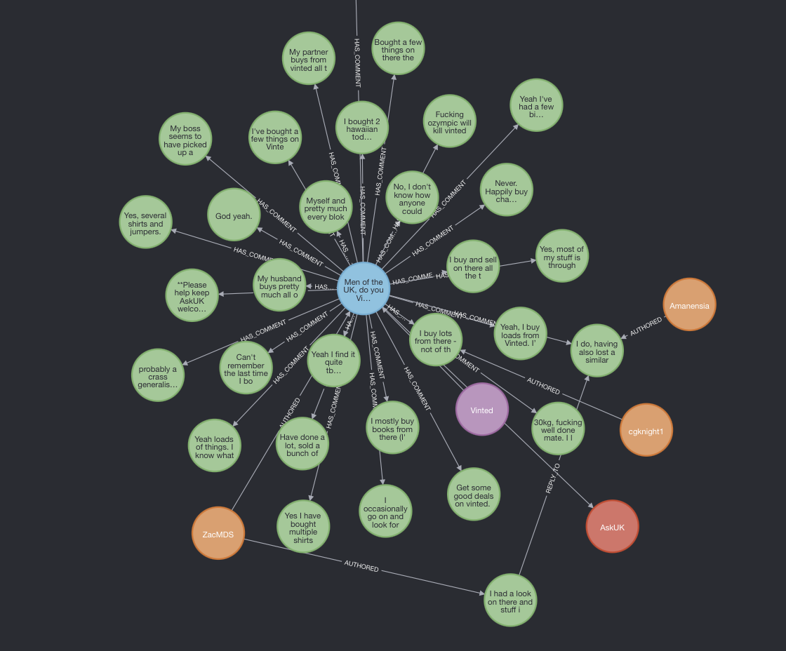

# Reddit Scraper & Graph Analyzer

A production-ready FastAPI service that scrapes trending Reddit posts and their complete comment trees using Apify, and persists the interactions into a Neo4j graph database.



## Features

- **Apify Integration**: Out-of-the-box support for the Apify Reddit Posts Scraper.
- **Hierarchical Parsing**: Recursively extracts deep comment trees and reply structures.
- **Graph Persistence**: Deterministically generates IDs to map Reddit data into an interconnected Neo4j graph:
  - `(Keyword) -[:RETURNED]-> (Post)`
  - `(User) -[:AUTHORED]-> (Post|Comment)`
  - `(Post) -[:BELONGS_TO]-> (Subreddit)`
  - `(Post) -[:HAS_COMMENT]-> (Comment)`
  - `(Comment) -[:REPLY_TO]-> (Comment)`
- **FastAPI Backend**: Minimal, asynchronous REST API.

## Requirements

- Python 3.12+
- `uv` (Python project manager)
- Docker Desktop (for running Neo4j)
- An [Apify](https://apify.com/) API Token

## Quickstart

### 1. Configure Environment

Create a `.env` file referencing `.env.example`:

```bash
APIFY_TOKEN=your_apify_api_token
NEO4J_URI=bolt://localhost:7687
NEO4J_USER=neo4j
NEO4J_PASSWORD=password
```

### 2. Start Neo4j Database

Run the Neo4j Community Edition container:

```bash
docker run -d --name neo4j -p 7474:7474 -p 7687:7687 \
  -e NEO4J_AUTH=neo4j/password neo4j:latest
```

### 3. Run the API

Install dependencies and start the Uvicorn server:

```bash
uv sync
uv run python main.py
```

### 4. Scrape Data

Trigger a scrape job using your preferred REST client (e.g., Bruno, Postman, or `curl`):

```bash
curl -X POST http://localhost:8000/scrape \
  -H "Content-Type: application/json" \
  -d '{
    "keyword": "Vinted",
    "limit": 5,
    "sort": "relevance",
    "time_filter": "day"
  }'
```

The API will trigger the Apify actor, parse the raw JSON data containing posts and nested comments, and immediately build the relations in Neo4j.

## Analyzing the Graph

Once data is scraped, open the Neo4j Browser at [http://localhost:7474](http://localhost:7474) (Login: `neo4j` / `password`).

**To view a specific post and its full comment tree:**
```cypher
MATCH path = (p:Post)-[:HAS_COMMENT|REPLY_TO*]->(c:Comment)
RETURN path
LIMIT 50
```

**To view users and their interactions across the ecosystem:**
```cypher
MATCH path = (k:Keyword)-[:RETURNED]->(p:Post)<-[:AUTHORED]-(u:User)
OPTIONAL MATCH comment_path = (p)-[:HAS_COMMENT|REPLY_TO*]->(c:Comment)<-[:AUTHORED]-(cu:User)
RETURN path, comment_path
LIMIT 20
```

*Tip: In the Neo4j Browser, click the node label pills (`User`, `Comment`, etc.) on the right side panel and select a Property key (like `username` or `body`) to show labels directly on the graph nodes!*
